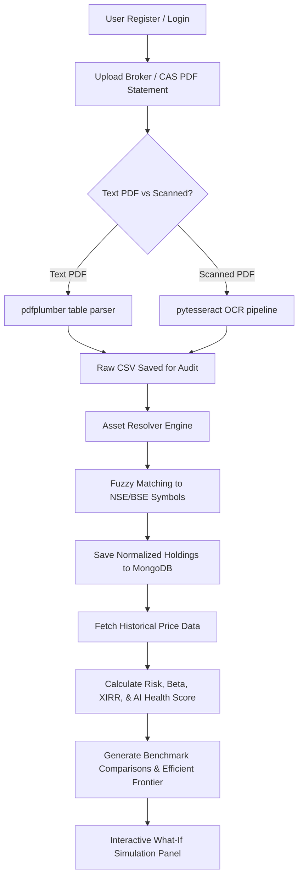
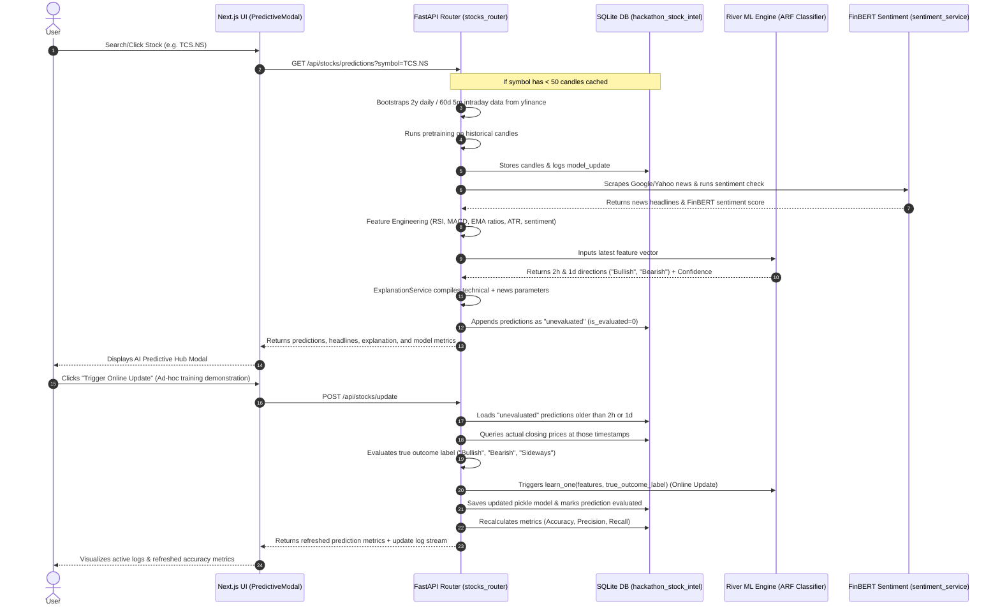

# Profolio AI — System Architecture & Workflow Guide

This document outlines the frontend technologies, backend technologies, core system workflow, and the detailed workflow of the newly implemented **AI Predictive Hub (Online Incremental Learning)** features.

---

## 🛠️ Technology Stack

### 1. Frontend (apps/web)
* **Framework**: Next.js 14 (App Router) & React 18
* **Language**: TypeScript
* **Styling & Animations**: 
  * **Tailwind CSS**: Utility-first styling for layout and component responsiveness.
  * **Framer Motion**: Smooth animations, hover micro-interactions, and modal fade-ins to establish a premium design aesthetic.
* **State & Authentication**: 
  * **NextAuth.js**: Client-side authentication handling, session state management, and JWT integration.
  * **Axios**: Promised-based HTTP client for structured API requests.
* **Data Visualization & Charts**:
  * **Recharts**: Responsive charting engine used to render the Portfolio Benchmark Comparison, Drawdown History, Sector Allocations, and SciPy-generated Efficient Frontier.

### 2. Backend (apps/api)
* **Framework**: FastAPI (high-performance asynchronous Python web framework)
* **Server**: Uvicorn (ASGI web server)
* **Databases**:
  * **MongoDB** (Primary): Leverages asynchronous connections via `Motor` and `ODMantic` ODM for user accounts, credentials, and portfolio holdings.
  * **SQLite** (Stock Intelligence Cache): High-speed local database storing market candles, generated prediction logs, and training timelines.
* **Parsing & OCR Engine**:
  * **pdfplumber**: Highly detailed Python engine for structural text and table extraction of NSDL/CDSL CAS, Zerodha, and Groww statements.
  * **Tesseract OCR (via pytesseract)** + **Pillow**: OCR fallback pipeline to parse scanned PDF statements.
* **Market Data Processing**:
  * **yfinance** + **curl_cffi**: Bypasses Yahoo Finance scraper blocking to extract real-time stock prices and historical candles.
  * **pandas** / **numpy** / **pyarrow** / **fastparquet**: High-performance local storage and processing of asset histories.
* **AI & Machine Learning (Predictive & Optimization)**:
  * **River ML**: Stream-learning Python library for online, incremental ML. Uses an `ARFClassifier` (Adaptive Random Forest) to learn from live data point-by-point.
  * **Hugging Face Transformers / FinBERT**: Financial NLP model used to classify scraped news headlines into Positive, Negative, or Neutral sentiments.
  * **SciPy Optimize**: Efficient Frontier portfolio optimization (Max Sharpe / Min Volatility) via convex optimization algorithms.
  * **PyTorch** & **Scikit-learn**: Core ML utilities and deep learning primitives.

---

## 🔄 Core Project Workflow

The standard user journey follows this sequence:

### Step 1: Authentication & Session Management
Users sign up or log in. Passwords are encrypted with `bcrypt` on the backend. The Next.js frontend negotiates authentication using NextAuth.js, storing a JWT token used to authorize subsequent API requests.

### Step 2: Statement Upload & Parsing Engine
The user uploads a Consolidated Account Statement (CAS) PDF or broker export.
* **Text PDF**: The backend reads table data using `pdfplumber`, parsing columns like Script Name, ISIN, Units, and Cost/Market Value.
* **Scanned PDF**: Fallback OCR process runs using `pytesseract` to extract structured texts from scanned images.
* **Audit Trail**: Every parsed statement saves to `data/debug/raw_extracts/` as a CSV file to allow admins to inspect raw parses.

### Step 3: Asset Resolver & Normalization
Since statements mention assets in raw names (e.g. `"TATA CONSULTANCY SERVICES LIMITED"`), the **Asset Resolver** maps these names or ISIN codes to active NSE/BSE tickers (e.g. `"TCS.NS"`). Normalized holdings are stored in MongoDB.

### Step 4: Analytics Engine & Health Score
The portfolio service calls the analytics module to calculate key indicators:
* **Base Metrics**: Beta, Sharpe Ratio, Volatility, XIRR, and total current market value.
* **AI Health Score**: A value from 0 to 100 representing portfolio diversification, risk-adjusted performance, and sector allocation.
* **Benchmark Simulation**: Compares the historical returns of the user's custom portfolio against **Nifty 50** and **Gold**.
* **Risk Breakdown**: Renders a cross-asset correlation matrix heatmap and peak-to-trough Drawdown metrics.

### Step 5: Portfolio Optimization (SciPy)
Calculates optimal portfolio weights under two standard models:
* **Aggressive Strategy**: Maximizes the Sharpe Ratio.
* **Conservative Strategy**: Minimizes portfolio Volatility.
Users can open an interactive **What-If Simulator** to modify individual holding shares, instantly recalculating the hypothetical portfolio performance and AI Health Score.

---

## 🧠 Workflow of Newly Implemented Features: AI Predictive Hub

The newly added features implement a state-of-the-art **Online Incremental Learning** setup. Models learn continuously from streaming data and adapt to market shifts in real-time, backed by explainable technical/sentiment metrics.

### Detailed Execution Sequence

#### 1. Target Ingestion & Database Initializer
On startup, the backend initializes `hackathon_stock_intel.db` (SQLite) containing:
* `candles`: Stores 5-minute and 1-day candles.
* `predictions`: Tracks historical predictions, feature dictionaries, and evaluation statuses.
* `model_updates`: Logs model update timestamps and samples processed.

#### 2. Bootstrap Pipeline
When a user requests predictions for a stock:
1. If the stock has less than 50 candles in the database, the backend scrapes historical data via `yfinance`.
2. It generates technical features and runs **pretraining** (`pretrain_on_history`) on historical data, saving initial model weights to `data/models/`.

#### 3. Real-time Feature Engineering & FinBERT Sentiment
On every fresh request:
1. **News Scraper**: Fetches Google News RSS feeds for query `"{SYMBOL} stock market"` filtering for major publications.
2. **FinBERT**: Sentiment service uses a Hugging Face FinBERT pipeline to classify each headline, outputting an aggregated sentiment score from -1.0 to +1.0.
3. **Feature Generation**: Combines the sentiment score with calculated technical indicators (EMA ratios, SMA ratios, RSI, MACD signal line crossovers, ATR, Relative Volume).

#### 4. Classification & Projection
1. The **River Adaptive Random Forest Classifier (ARF)** uses the feature vector to output the projected direction: **Bullish, Bearish, or Sideways**.
2. Projections are computed for a **2-Hour Intraday** window and a **Next-Day** window.
3. Calculates prediction confidence based on the forest's class probability distributions.

#### 5. Explainable AI Justification
The prediction values and active feature indicators pass through `ExplanationService.py`. It constructs human-readable plain English sentences explaining the recommendation, for example:
* *“BUY recommendation generated because: volume surged 140% above its 20-candle average, and FinBERT news sentiment is highly optimistic (+0.62).”*
* *“HOLD recommended because: although direction is Bullish with high confidence (84%), the expected return (+0.2%) is below our 0.5% threshold required for a new BUY entry.”*

#### 6. Continuous Incremental Learning & Metric Evaluation
When an update is triggered (either automatically or manually via the "Trigger Online Update" button in the modal):
1. **Outcome Evaluation**: The backend fetches all unevaluated predictions where the target time has elapsed (e.g. 2 hours later).
2. It fetches the actual close price at the target time from the SQLite `candles` table.
3. It determines the true outcome direction based on actual price returns:
   * **Intraday Return > +0.5%** ➔ `Bullish`
   * **Intraday Return < -0.5%** ➔ `Bearish`
   * **Otherwise** ➔ `Sideways`
4. **Online Training Step**: The model runs `model.learn_one(features, actual_label)`, updating model weights on-the-fly. The updated model is pickled.
5. **Validation Metrics**: Re-calculates model performance figures:
   * **Accuracy**: Correct predictions / Total evaluated.
   * **Precision**: Ratio of true bullish signals to total predicted bullish signals.
   * **Recall**: Ratio of true bullish signals to total actual bullish occurrences.
6. The updated metrics and real-time logs are piped back to the Next.js frontend, updating the dashboard instantly.
